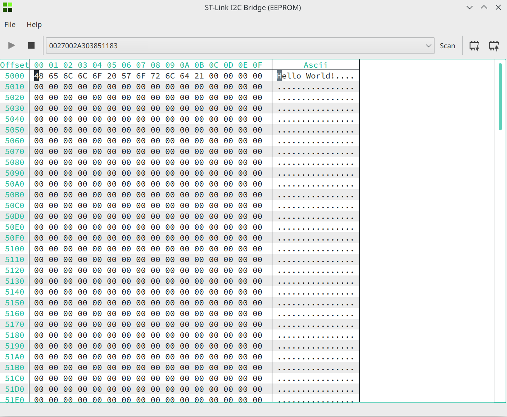

# A set of demo applications for the ST Link V3 Bridge functionality

Bridge API provided by ST: a small change has been made here in order to access the API
via libusb (original project is https://github.com/martonmiklos/STLINK-V3-BRIDGE_libusb).

## ST Bridge GPIO

The application ST-Link GPIO Bridge is an example of how the ST-Link V3 debugger
can be used to control the 4 GPIO pins that are user accessible through the Bridge
API. 

## ST Bridge I2C

Reading and writting data over I2C on a EEPROM chip (AT24C04N in my case). The Bridge API is used to read and write the entire content of the EEPROM (hardcoded in the defines). QHexView is used to display/edit the data (https://github.com/Dax89/QHexView).